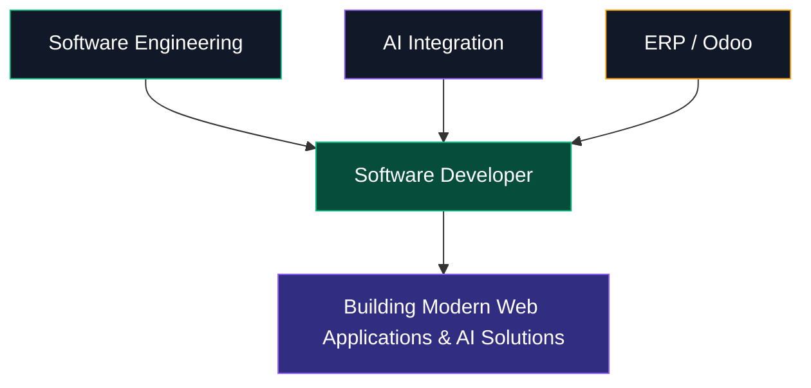

<div align="center">

<!-- ═══════════════════════════════════════════════════════════════ -->

<!-- HERO SECTION -->

<!-- ═══════════════════════════════════════════════════════════════ -->


<!-- NAME -->


<!-- SINGLE-LINE TYPING / DELETE ANIMATION -->


<!-- DIVIDER -->


</div>

---

<!-- ═══════════════════════════════════════════════════════════════ -->

<!-- STATS ROW -->

<!-- ═══════════════════════════════════════════════════════════════ -->

<div align="center">


</div>

---

<!-- ═══════════════════════════════════════════════════════════════ -->

<!-- SOCIAL LINKS -->

<!-- ═══════════════════════════════════════════════════════════════ -->

<div align="center">

[](https://yohanneswegayehu.vercel.app)
[](https://www.linkedin.com/in/yohannes-wegayehu)
[](https://github.com/yohannes-wegayehu)
[](https://x.com/yohannes_dev)
[](https://t.me/yohannes_tech_bot)
[](mailto:yohanneswegayehu21@gmail.com)

</div>

---

<!-- ═══════════════════════════════════════════════════════════════ -->

<!-- ABOUT ME -->

<!-- ═══════════════════════════════════════════════════════════════ -->

<div align="center">

###  About Me

</div>

<div>

```typescript
const yohannes = {
  name: "Yohannes Wegayehu Demise",
  title: "Software Developer & AI Integration Specialist",
  experience: "3+ years of practical software development",

  location: [
    "Addis Ababa, Ethiopia",
    "Debre Berhan, Ethiopia"
  ],

  education: "Computer Science @ Debre Berhan University",

  currentFocus: {
    fullStack:
      "Building modern web applications with React, Next.js, Node.js",

    aiIntegration:
      "Integrating AI APIs into real-world applications",

    erp:
      "Developing enterprise solutions with Odoo ERP"
  },

  whatIDo: [
    "Full-stack web applications",
    "AI-powered applications",
    "Enterprise ERP solutions",
    "Real-time applications",
    "Telegram AI Bots"
  ],

  techStack: [
    "React",
    "Next.js",
    "Node.js",
    "TypeScript",
    "PostgreSQL",
    "MongoDB",
    "Python",
    "Odoo"
  ],

  aiStack: [
    "OpenAI",
    "Google Gemini",
    "Groq"
  ],

  available: true,

  contact: {
    email: "yohanneswegayehu21@gmail.com",
    phone: "+251 951 748 563"
  }
};
```

</div>

---

<!-- ═══════════════════════════════════════════════════════════════ -->

<!-- PROFESSIONAL POSITIONING -->

<!-- ═══════════════════════════════════════════════════════════════ -->

<div align="center">

###  Professional Positioning

</div>

<div align="center">



</div>

---

<!-- ═══════════════════════════════════════════════════════════════ -->

<!-- TECHNOLOGY STACK -->

<!-- ═══════════════════════════════════════════════════════════════ -->

<div align="center">

###  Technology Stack

<p>
  Technologies and tools I use to build modern, scalable, and intelligent applications.
</p>

</div>

<br>

<div align="center">

#### 💻 Languages

<a href="https://www.typescriptlang.org">

</a>&nbsp;&nbsp;

<a href="https://developer.mozilla.org/en-US/docs/Web/JavaScript">

</a>&nbsp;&nbsp;

<a href="https://www.python.org">

</a>&nbsp;&nbsp;

<a href="https://www.java.com">

</a>

<br><br>

#### 🎨 Frontend

<a href="https://react.dev">

</a>&nbsp;&nbsp;

<a href="https://nextjs.org">

</a>&nbsp;&nbsp;

<a href="https://tailwindcss.com">

</a>&nbsp;&nbsp;

<a href="https://vite.dev">

</a>&nbsp;&nbsp;

<a href="https://mui.com">

</a>

<br><br>

#### ⚙️ Backend

<a href="https://nodejs.org">

</a>&nbsp;&nbsp;

<a href="https://expressjs.com">

</a>&nbsp;&nbsp;

<a href="https://fastapi.tiangolo.com">

</a>&nbsp;&nbsp;

<a href="https://spring.io">

</a>

<br><br>

#### 🗄️ Databases

<a href="https://www.postgresql.org">

</a>&nbsp;&nbsp;

<a href="https://www.mongodb.com">

</a>&nbsp;&nbsp;

<a href="https://www.mysql.com">

</a>&nbsp;&nbsp;

<a href="https://firebase.google.com">

</a>

<br><br>

#### 🤖 AI & Data

<a href="https://numpy.org">

</a>&nbsp;&nbsp;

<a href="https://pandas.pydata.org">

</a>&nbsp;&nbsp;

<a href="https://scikit-learn.org">

</a>

<br><br>

#### 🛠️ Tools & Deployment

<a href="https://git-scm.com">

</a>&nbsp;&nbsp;

<a href="https://github.com">

</a>&nbsp;&nbsp;

<a href="https://www.docker.com">

</a>&nbsp;&nbsp;

<a href="https://vercel.com">

</a>&nbsp;&nbsp;

<a href="https://www.postman.com">

</a>&nbsp;&nbsp;

<a href="https://www.figma.com">

</a>

<br><br>

#### 🚀 Specialized


</div>

---

<!-- ═══════════════════════════════════════════════════════════════ -->

<!-- SERVICES -->

<!-- ═══════════════════════════════════════════════════════════════ -->

<div align="center">

###  Services

<p>
  Turning ideas into scalable applications, intelligent systems, and business solutions.
</p>

</div>

<br>

<div >

```python
class YohannesServices:

    def web_development(self):
        return {
            "frontend": [
                "React",
                "Next.js",
                "TypeScript",
                "Tailwind CSS"
            ],
            "backend": [
                "Node.js",
                "Express",
                "REST APIs"
            ],
            "database": [
                "PostgreSQL",
                "MongoDB",
                "Firebase"
            ],
            "solutions": [
                "Responsive Web Applications",
                "Authentication & Authorization",
                "Real-time Applications",
                "API Integration"
            ]
        }

    def ai_integration(self):
        return {
            "ai_platforms": [
                "OpenAI",
                "Google Gemini",
                "Groq"
            ],
            "solutions": [
                "AI Chatbots",
                "AI Assistants",
                "AI-Powered Applications",
                "Telegram AI Bots",
                "AI Workflow Automation"
            ]
        }

    def erp_development(self):
        return {
            "platform": "Odoo ERP",
            "solutions": [
                "Custom Odoo Modules",
                "ERP Customization",
                "Business Workflow Automation",
                "QWeb Development",
                "Procurement & Tender Systems"
            ]
        }

    def cloud_deployment(self):
        return {
            "platforms": [
                "Vercel",
                "Docker"
            ],
            "services": [
                "Production Deployment",
                "Application Configuration",
                "Git & GitHub Workflows",
                "Hosting Support"
            ]
        }


developer = YohannesServices()

developer.web_development()
# → Modern Web Applications & Backend Systems

developer.ai_integration()
# → Intelligent AI-Powered Solutions

developer.erp_development()
# → Enterprise ERP & Business Solutions

developer.cloud_deployment()
# → Deployment & Production Infrastructure
```

</div>

<br>

<div align="center">


</div>

---

<!-- ═══════════════════════════════════════════════════════════════ -->

<!-- GITHUB CONTRIBUTIONS -->

<!-- ═══════════════════════════════════════════════════════════════ -->

<div align="center">

###  GitHub Contributions

</div>

<div align="center">


</div>

---

<!-- ═══════════════════════════════════════════════════════════════ -->

<!-- LET'S CONNECT -->

<!-- ═══════════════════════════════════════════════════════════════ -->

<div align="center">

###  Let's Build Something Meaningful

</div>

<div align="center">

**Available for:**


</div>

<br>

<div align="center">

[](mailto:yohanneswegayehu21@gmail.com)
[](https://yohanneswegayehu.vercel.app)
[](https://www.linkedin.com/in/yohannes-wegayehu)
[](https://github.com/yohannes-wegayehu)
[](https://x.com/yohannes_dev)
[](https://t.me/yohannes_tech_bot)

</div>

<br>

<div align="center">

**Phone:** +251 951 748 563
**Email:** [yohanneswegayehu21@gmail.com](mailto:yohanneswegayehu21@gmail.com)
**Location:** Addis Ababa & Debre Berhan, Ethiopia

</div>

---

<div align="center">


</div>
