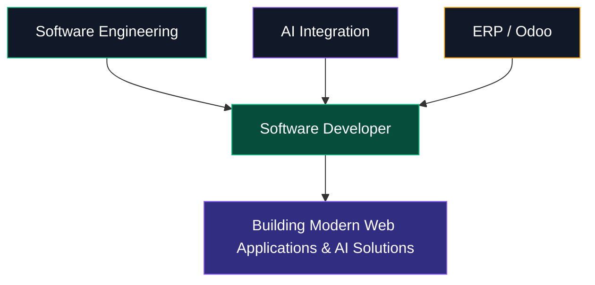

<div align="center">

<!-- ═══════════════════════════════════════════════════════════════ -->
<!-- HERO SECTION -->
<!-- ═══════════════════════════════════════════════════════════════ -->


<!-- NAME -->


<!-- TYPING ANIMATION - TYPE & DELETE -->


<!-- DIVIDER -->


</div>

---

<!-- ═══════════════════════════════════════════════════════════════ -->
<!-- STATS ROW -->
<!-- ═══════════════════════════════════════════════════════════════ -->

<div align="center">


</div>

---

<!-- ═══════════════════════════════════════════════════════════════ -->
<!-- SOCIAL LINKS -->
<!-- ═══════════════════════════════════════════════════════════════ -->

<div align="center">

[](https://yohanneswegayehu.vercel.app)
[](https://www.linkedin.com/in/yohannes-wegayehu)
[](https://github.com/yohannes-wegayehu)
[](https://x.com/yohannes_dev)
[](https://t.me/yohannes_tech_bot)
[](mailto:yohanneswegayehu21@gmail.com)

</div>

---

<!-- ═══════════════════════════════════════════════════════════════ -->
<!-- ABOUT ME -->
<!-- ═══════════════════════════════════════════════════════════════ -->

<div align="center">

###  About Me

</div>

<div >

```typescript
const yohannes = {
  name: "Yohannes Wegayehu Demise",
  title: "Software Developer & AI Integration Specialist",
  experience: "3+ years of practical software development",
  location: ["Addis Ababa, Ethiopia", "Debre Berhan, Ethiopia"],
  education: "Computer Science @ Debre Berhan University",
  currentFocus: {
    fullStack: "Building modern web applications with React, Next.js, Node.js",
    aiIntegration: "Integrating AI APIs into real-world applications",
    erp: "Developing enterprise solutions with Odoo ERP"
  },
  whatIDo: [
    "Full-stack web applications",
    "AI-powered applications",
    "Enterprise ERP solutions",
    "Real-time applications",
    "Telegram AI Bots"
  ],
  techStack: ["React", "Next.js", "Node.js", "TypeScript", "PostgreSQL", "MongoDB", "Python", "Odoo"],
  aiStack: ["OpenAI", "Google Gemini", "Groq"],
  available: true,
  contact: {
    email: "yohanneswegayehu21@gmail.com",
    phone: "+251 951 748 563"
  }
};
```

</div>

---

<!-- ═══════════════════════════════════════════════════════════════ -->
<!-- PROFESSIONAL POSITIONING -->
<!-- ═══════════════════════════════════════════════════════════════ -->

<div align="center">

###  Professional Positioning

</div>

<div align="center">



</div>

---

<!-- ═══════════════════════════════════════════════════════════════ -->
<!-- TECHNOLOGY STACK -->
<!-- ═══════════════════════════════════════════════════════════════ -->

<div align="center">

###  Technology Stack

</div>

<table>
<tr>
<td width="25%" align="center" valign="top">

**FRONTEND**

<br>React

<br>Next.js

<br>TypeScript

<br>JavaScript

</td>
<td width="25%" align="center" valign="top">

**BACKEND**

<br>Node.js

<br>Express

<br>Python

</td>
<td width="25%" align="center" valign="top">

**DATABASE**

<br>PostgreSQL

<br>MongoDB

<br>Firebase

</td>
<td width="25%" align="center" valign="top">

**TOOLS**

<br>Git

<br>Docker

<br>Figma

</td>
</tr>
</table>

<div align="center">


</div>

---

<!-- ═══════════════════════════════════════════════════════════════ -->
<!-- SERVICES -->
<!-- ═══════════════════════════════════════════════════════════════ -->

<div align="center">

###  Services

</div>

<table>
<tr>
<td width="50%" valign="top">

**Full-Stack Development**
- React & Next.js Applications
- Node.js & Express Backend
- REST APIs & Database Design
- Authentication & Authorization
- Responsive Web Applications

</td>
<td width="50%" valign="top">

**AI Integration**
- AI Chatbot Development
- AI Assistant Integration
- OpenAI / Gemini / Groq APIs
- Telegram AI Bots
- AI-Powered Web Applications

</td>
</tr>
<tr>
<td width="50%" valign="top">

**ERP / Odoo Development**
- Custom Odoo Modules
- ERP Customization
- Business Workflow Automation
- QWeb Development
- Procurement & Tender Systems

</td>
<td width="50%" valign="top">

**Cloud & Deployment**
- Vercel Deployment
- Git / GitHub Workflows
- Docker Development
- Application Configuration
- Hosting Support

</td>
</tr>
</table>

---

<!-- ═══════════════════════════════════════════════════════════════ -->
<!-- GITHUB ACTIVITY -->
<!-- ═══════════════════════════════════════════════════════════════ -->

<div align="center">

###  GitHub Activity

</div>

<div align="center">


</div>

---

<!-- ═══════════════════════════════════════════════════════════════ -->
<!-- LET'S CONNECT -->
<!-- ═══════════════════════════════════════════════════════════════ -->

<div align="center">

###  Let's Build Something Meaningful

</div>

<div align="center">

**Available for:**


</div>

<br>

<div align="center">

[](mailto:yohanneswegayehu21@gmail.com)
[](https://yohanneswegayehu.vercel.app)
[](https://www.linkedin.com/in/yohannes-wegayehu)
[](https://github.com/yohannes-wegayehu)
[](https://x.com/yohannes_dev)
[](https://t.me/yohannes_tech_bot)

</div>

<br>

<div align="center">

**Phone:** +251 951 748 563
**Email:** yohanneswegayehu21@gmail.com
**Location:** Addis Ababa & Debre Berhan, Ethiopia

</div>

---

<div align="center">


</div>
