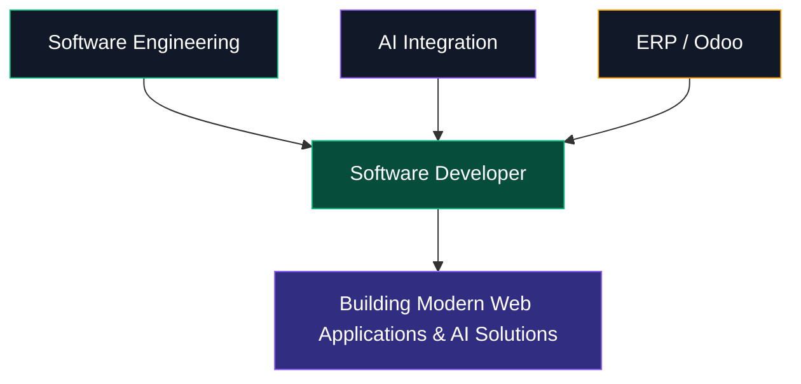
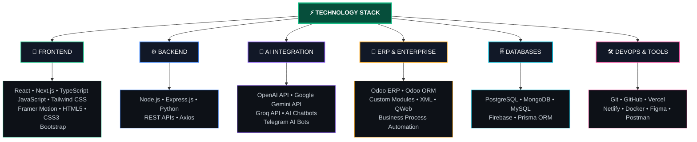
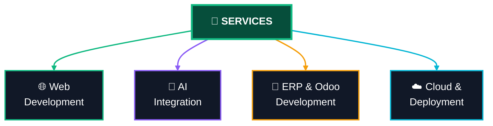

<div align="center">

<!-- ═══════════════════════════════════════════════════════════════ -->

<!-- HERO SECTION -->

<!-- ═══════════════════════════════════════════════════════════════ -->


<!-- NAME -->


<!-- SINGLE-LINE TYPING / DELETE ANIMATION -->


<!-- DIVIDER -->


</div>

---

<!-- ═══════════════════════════════════════════════════════════════ -->

<!-- STATS ROW -->

<!-- ═══════════════════════════════════════════════════════════════ -->

<div align="center">


</div>

---

<!-- ═══════════════════════════════════════════════════════════════ -->

<!-- SOCIAL LINKS -->

<!-- ═══════════════════════════════════════════════════════════════ -->

<div align="center">

[](https://yohanneswegayehu.vercel.app)
[](https://www.linkedin.com/in/yohannes-wegayehu)
[](https://github.com/yohannes-wegayehu)
[](https://x.com/yohannes_dev)
[](https://t.me/yohannes_tech_bot)
[](mailto:yohanneswegayehu21@gmail.com)

</div>

---

<!-- ═══════════════════════════════════════════════════════════════ -->

<!-- ABOUT ME -->

<!-- ═══════════════════════════════════════════════════════════════ -->

<div align="center">

###  About Me

</div>

<div>

```typescript
const yohannes = {
  name: "Yohannes Wegayehu Demise",
  title: "Full-Stack Developer & AI Integration Specialist",
  experience: "3+ years in software development",
  location: ["Addis Ababa, Ethiopia", "Debre Berhan, Ethiopia"],
  education: "Computer Science @ Debre Berhan University",
  currentFocus: "Building AI-powered web applications & ERP systems",
  askMeAbout: ["React", "Next.js", "Node.js", "Python", "Odoo ERP", "AI Integration"],
  funFact: "I turn complex problems into elegant solutions"
};
```

</div>

---

<!-- ═══════════════════════════════════════════════════════════════ -->

<!-- PROFESSIONAL POSITIONING -->

<!-- ═══════════════════════════════════════════════════════════════ -->

<div align="center">

###  Professional Positioning

</div>

<div align="center">



</div>

---

<!-- ═══════════════════════════════════════════════════════════════ -->
<!-- TECHNOLOGY STACK -->
<!-- ═══════════════════════════════════════════════════════════════ -->

<div align="center">

###  Technology Stack

</div>


<!-- ═══════════════════════════════════════════════════════════════ -->

<!-- SERVICES -->

<!-- ═══════════════════════════════════════════════════════════════ -->

<div align="center">

###  Services

</div>

<div align="center">


<br>

   

</div>


<!-- ═══════════════════════════════════════════════════════════════ -->

<!-- GITHUB CONTRIBUTIONS -->

<!-- ═══════════════════════════════════════════════════════════════ -->

<div align="center">

###  GitHub Contributions

</div>

<div align="center">


</div>

---

<!-- ═══════════════════════════════════════════════════════════════ -->

<!-- LET'S CONNECT -->

<!-- ═══════════════════════════════════════════════════════════════ -->

<div align="center">

###  Let's Build Something Meaningful

</div>

<div align="center">

**Available for:**


</div>

<br>

<div align="center">

[](mailto:yohanneswegayehu21@gmail.com)
[](https://yohanneswegayehu.vercel.app)
[](https://www.linkedin.com/in/yohannes-wegayehu)
[](https://github.com/yohannes-wegayehu)
[](https://x.com/yohannes_dev)
[](https://t.me/yohannes_tech_bot)

</div>

<br>

<div align="center">

**Phone:** +251 951 748 563
**Email:** [yohanneswegayehu21@gmail.com](mailto:yohanneswegayehu21@gmail.com)
**Location:** Addis Ababa & Debre Berhan, Ethiopia

</div>

---

<div align="center">


</div>
