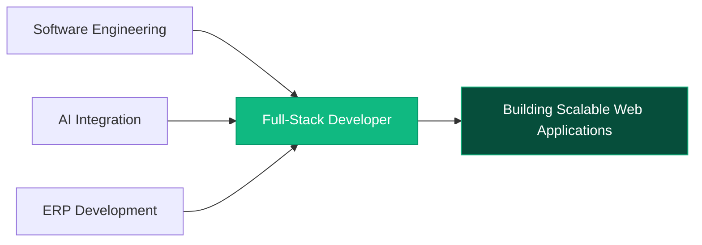

<div align="center">

<!-- HEADER -->


<!-- TYPING SVG -->
[](https://git.io/typing-svg)

</div>

---

## About Me

```typescript
const yohannes = {
  name: "Yohannes Wegayehu Demise",
  title: "Full-Stack Developer & AI Integration Specialist",
  experience: "3+ years",
  location: ["Addis Ababa, Ethiopia", "Debre Berhan, Ethiopia"],
  education: "Computer Science @ Debre Berhan University",
  currentFocus: "Building AI-powered web applications & ERP systems",
  askMeAbout: ["React", "Next.js", "Node.js", "Python", "Odoo ERP", "AI Integration"],
  funFact: "I turn complex problems into elegant solutions"
};
```

---

## Quick Links

[](https://yohanneswegayehu.vercel.app)
[](https://www.linkedin.com/in/yohannes-wegayehu)
[](https://github.com/yohannes-wegayehu)
[](https://x.com/yohannes_dev)
[](https://t.me/yohannes_tech_bot)

---

## GitHub Stats

<div align="center">

<!-- STATS CARDS -->


<!-- STREAK STATS -->


</div>

---

## Tech Stack

<div align="center">

<!-- FRONTEND -->


<!-- BACKEND -->


<!-- DATABASES -->


<!-- AI & ERP -->


<!-- TOOLS -->


</div>

---

## Featured Projects

<table>
<tr>
<td width="50%" valign="top">

### AfriGebeya
**Full-Stack E-Commerce Platform**
<br>


Full-stack e-commerce with authentication, product management, shopping cart, and payment integration.

[](https://afrigebeya.vercel.app)

</td>
<td width="50%" valign="top">

### SocialNook
**Real-Time Social Media Platform**
<br>


Real-time social media with posts, likes, comments, chat, and Socket.io integration.

[](https://socialnook.vercel.app)

</td>
</tr>
<tr>
<td width="50%" valign="top">

### SprintTask
**Project Management System**
<br>


Project management with task tracking, priorities, and role-based access control.

[](https://sprinttask.vercel.app)

</td>
<td width="50%" valign="top">

### Professional Portfolio
**Next.js AI-Powered Portfolio**
<br>


Modern portfolio with AI chatbot, animations, and responsive design.

[](https://yohanneswegayehu.vercel.app)

</td>
</tr>
</table>

---

## GitHub Trophies

<div align="center">

[](https://github.com/ryo-ma/github-profile-trophy)

</div>

---

## Contribution Graph

<div align="center">


</div>

---

## Snake Animation

<div align="center">


</div>

---

## Professional Positioning

<div align="center">



</div>

---

## Currently Working On

- Building AI-powered web applications with **Gemini** and **Groq** APIs
- Developing **Odoo ERP** custom modules and enterprise solutions
- Creating **Telegram AI Bots** for business automation
- Contributing to **open-source** projects

---

## Let's Connect

<div align="center">

[](mailto:yohanneswegayehu21@gmail.com)
[](https://yohanneswegayehu.vercel.app)
[](https://www.linkedin.com/in/yohannes-wegayehu)
[](https://github.com/yohannes-wegayehu)
[](https://x.com/yohannes_dev)
[](https://t.me/yohannes_tech_bot)

</div>

---

<div align="center">

<!-- FOOTER -->


</div>
